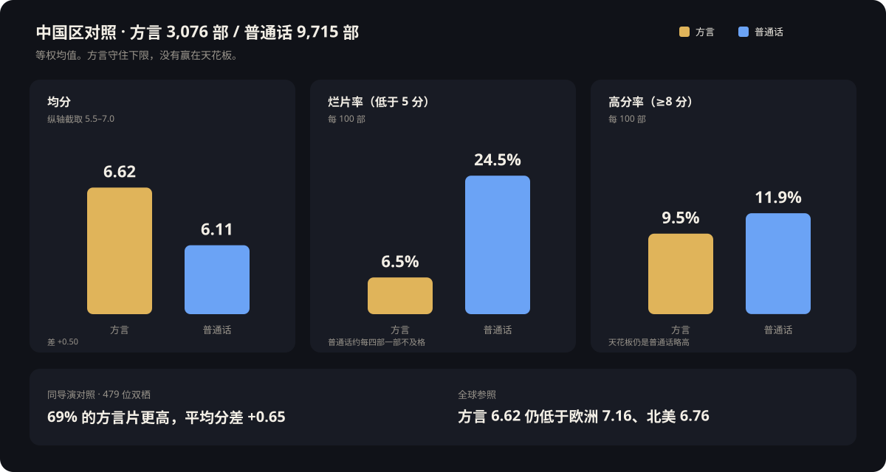
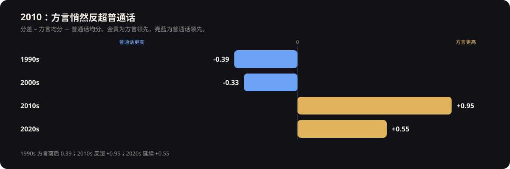
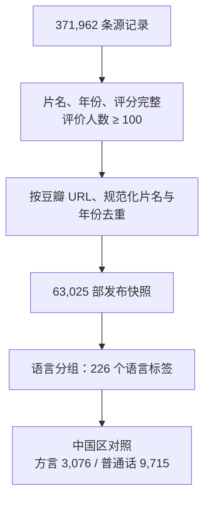

# 「言」之有物：从数据看中国电影的答案

[](https://github.com/XinyD/Data-Journalism-Dialect-Films/actions/workflows/validate.yml)

一篇由 **63,025 部电影**构成的交互式数据新闻。从潮汕方言电影《给阿嬷的情书》出发，追问：观众厌倦了什么，又在为什么买单。

读者向下滚动时，电影粒子会按类型、地区、年代和语言重排。每一幕都可以改变比较条件、核对统计量，并点开具体电影查看简介与来源。

**在线阅读：** <https://XinyD.github.io/Data-Journalism-Dialect-Films/>

<p align="center">
  
</p>
<p align="center"><sub>封面。一个点就是一部电影；向下滚动，粒子会随叙事重排。</sub></p>

## 核心发现

中国区对照（第一出品国为中国；方言 3,076 部，普通话 9,715 部）：

| 比较 | 结果 |
| --- | --- |
| 方言 vs 普通话均分 | 方言 6.62，普通话 6.11，差 +0.50 |
| 烂片率（<5 分） | 方言 6.5%，普通话 24.5% |
| 高分率（≥8 分） | 方言 9.5%，普通话 11.9%。方言守住下限，没有赢在天花板 |
| 2010 反超 | 1990s 方言落后 0.39；2010s 反超 +0.95；2020s 延续 +0.55 |
| 全球参照 | 方言均分仍低于欧洲 7.16、北美 6.76 |
| 同导演 | 479 位双栖导演中 69% 的方言片更高，平均分差 +0.65 |

<p align="center">
  
</p>
<p align="center"><sub>金黄是方言，亮蓝是普通话。最醒目的不是均分差 0.50，而是烂片率：6.5% 对 24.5%。</sub></p>

<p align="center">
  
</p>
<p align="center"><sub>方言并不是一开始就领先。换向发生在 2010 年代。</sub></p>

故事的结论不是「方言本身更高」，而是：认真讲完的故事更少跌破下限。语言不是原因，内容才是。

## 报道结构

<p align="center">
  
</p>

- **封面与引言**：六万余部电影铺成粒子宇宙；从《给阿嬷的情书》提出问题。
- **格局**：中国在五大产区均分垫底，低于 5 分的比例最高。
- **发现**：华语内部，方言片均分更高、烂片更少；换向发生在 2010 年代。
- **对照**：全球下限、方言烂片的失败路径、同一导演跨语言对比。
- **三波浪潮**：港片粤语、西南方言、闽南语新浪潮。
- **五维与终章**：好故事的样子；进入探索舱，按年代、地区、语言自由筛选。

每幕配有数据卡：筛选、均值、中位数、标准差、四分位数、高分占比，以及随机打捞。粒子和电影卡片均可打开简介、导演、语言、评价人数与来源记录。

## 数据与方法



- **样本**：从 371,962 条源记录中保留片名、年份、评分完整且评价人数不少于 100 的条目，再按豆瓣条目 URL、规范化片名与年份去重，得到 **63,025** 部（1888–2026）。
- **条目范围**：沿用豆瓣电影频道宽口径，含长片、短片、纪录片、动画、演出影像及部分电视条目。
- **地区与类型**：地区取第一出品国／地区；主类型取类型列表第一项。正文中国区对照采用第一出品国为中国的条目（12,791 部）。
- **语言分组**：英语、日语、韩语、普通话、方言、其他六组；混合语种按片单首位归组。方言判定以 [《方言电影定义》](方言电影定义_最终版_v4.1_Final.md) 为准：226 个语言标签、17 组。中国区方言片 3,076 部（纯方言 2,309 / 方言排首 421 / 普通话排首经证据补回 346）。
- **近年覆盖**：2020–2026 批次源表缺语言列，已按豆瓣详情回填已抓到的条目；未抓到的中国电影默认归入普通话组。2022 年及以后共 7,190 部，中国约占 15.4%；2020s 中国方言片 88 部。
- **计算**：每部电影等权计入；页面同时披露按评价人数加权的总体均分。正文高分率用 ≥8.0，数据卡高分参考线为 8.5。

这是按上述门槛筛选的观察性比较，未做显著性检验、因果识别或跨平台评分校准。

发布快照指纹（SHA-256）：

```text
0ad6ce7886a3a907e9e597048b83da173226ae6076f691a7e2c5083f104f6421
```

## 本地预览

不需要安装第三方包，使用 Python 自带的 HTTP 服务器即可：

```bash
git clone https://github.com/XinyD/Data-Journalism-Dialect-Films.git
cd Data-Journalism-Dialect-Films
python serve.py
```

浏览器打开 <http://127.0.0.1:8000/frontend/index.html>。请通过 HTTP 访问，不要直接双击 HTML。端口占用时可加 `--port 8011`。

前端打包产物已提交在 `frontend/build/`。修改 `frontend/js` 后需要 Node.js 20+：

```bash
npm ci
npm run build
npm run check
```

社交分享需要绝对地址的 `og:image` 时，构建前设置 `SITE_URL`。

## 复现发布快照

推荐 Python 3.12，直接依赖见 `requirements.txt`。GitHub Actions 会在每次 Push 和 Pull Request 中自动重建、测试并核对确定性。

```bash
python -m venv .venv
source .venv/bin/activate          # Windows: .\.venv\Scripts\Activate.ps1
python -m pip install -r requirements.txt
python rebuild.py
python -m unittest discover -s tests -v
```

`rebuild.py` 从规范快照 `data/cleaned/derived_movies.csv` 生成前端载荷、叙事事实、粒子坐标与方言报告。成功时应得到 63,025 条发布记录、64 个详情分片，以及与指纹一致的核心载荷。

完整处理流程、字段说明与从上游源表重建步骤见 [`data/DATA_PIPELINE.md`](data/DATA_PIPELINE.md)。本仓库可复现**当前发布版本的计算过程**；原始抓取脚本与上游全量源表不在仓库内。

| 路径 | 用途 |
| --- | --- |
| `data/cleaned/derived_movies.csv` | 规范发布快照，重建默认输入 |
| `data/cleaned/sample_manifest.json` | 筛选条件、阶段计数与 SHA-256 指纹 |
| `data/narrative_facts.json` | 正文数字与标准化分析 |
| `data/frontend_dataset.json` | 首页与探索舱浏览器载荷 |
| `data/frontend/particles.json` | 粒子坐标 |
| `data/frontend/details/*.json` | 简介、导演、语言与来源链接（64 分片） |
| `data/frontend/dialect_aggregates.json` | 方言叙事聚合 |
| `data/frontend/geo_enrichment.json` | 第一出品国视觉地理 |
| `data/dialect_films/report_data_strict.json` | 中国区方言分层结果 |

规范快照主要字段：`movie_id`、片名、年份、导演、类型、制片国家/地区、语言、豆瓣评分、评价人数、剧情简介、`Decade`、`Region`、`Genre_Code`、`Language_Code`、`Is_Dialect`。

## 项目结构

```text
.
├── frontend/                 数据新闻页面、样式、图表源码与 hashed 构建产物
├── data/                     规范快照与全部发布载荷
├── scripts/                  清洗、聚合、事实提取与粒子生成
├── tests/                    数据与叙事回归测试
├── docs/preview.webp         README 预览图
├── docs/chart-findings.svg   核心发现对照图
├── docs/chart-overtake.svg   2010 反超图
├── docs/story-map.svg        报道六幕
├── config.py                 仓库内可移植路径
├── rebuild.py                一键重建发布载荷
├── serve.py                  零依赖本地预览
├── index.html                GitHub Pages 入口
└── 方言电影定义_最终版_v4.1_Final.md
```

## 数据使用

代码和页面可用于研究、教学与数据新闻实践。电影元数据、剧情简介、来源链接及 AI 生成文本的再分发，应继续遵守相应数据来源、平台和模型服务的使用条款。本仓库没有为第三方数据声明额外授权。
